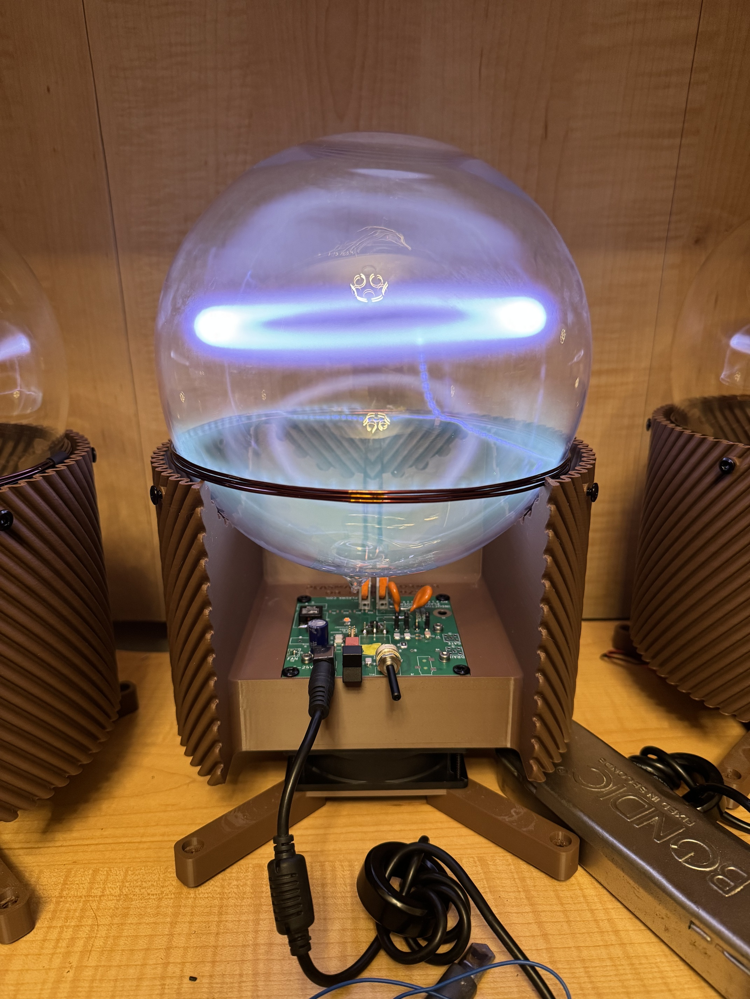
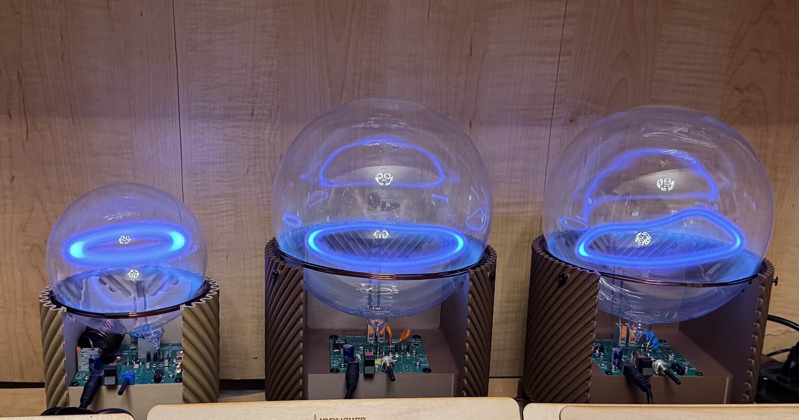

# Plasma Transformer
## An open-source plasma toroid project by inceptionev (Dr. Bunga)

This project mainly focuses on creating a driver and 3D-printed support structure that allows for safe continuous operation of a plasma toroid.  The objectives are stable operation of a levitating halo of plasma while providing airflow to keep both the electronics and the globe cool.  The globes are filled with a low-pressure of xenon gas.

The most current work is on the 20cm diameter globe size, but files are also provided for the 13cm globe.

KiCAD PCB files are found in the root folder.

3d print files and a dxf for the heatsink hole pattern are found in the 3D Print and CNC folder.  The heatsink holes are all M3 drill/tap.

## Known successful values from experimentation:

Supply Voltage:
- 20cm Globe: 24V
- 13cm Globe: 19V

Gate-Drain Cap:
- 20cm Globe: none
- 13cm Globe: 220nF + 220nF

Resonant Cap:
- 20cm Globe: 2x 24pF 564RC0GAJ602EJ240J
- 13cm Globe: 5x 12pF CGP1C120KNSDAAWL25

Gate-Source Cap:
- 20cm Globe: 2.7nF + 1.8nF + 1.8nF
- 13cm Globe: 2.7nF
